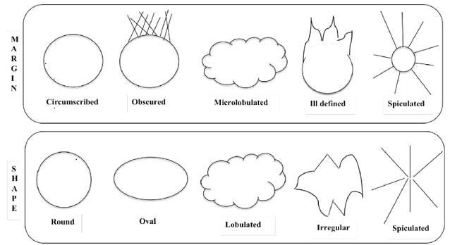

## Purpose

This `Shiny` app allows users to explore mammographic mass data and fit models for predicting mass 
status through repeated cross-validated supervised learning models.

---
---
## App Pages

---
### About

This page describes the purpose of this app, outlines each app page, and provides background 
information for the data used in this app.

---
### Data

Displays the data set `mammographic_masses` and allows for `filtering`, `subsetting` and 
`downloading` the data.

---
### Data Exploration

Renders plots and numeric summaries based on user selections.

#### Graphical Summary

Three plots can be created `box`, `histogram`, and `bar`. These plots have corresponding options for
 variable selection and aesthetic changes such as color palette selection.

#### Numeric Summary

This tab generates customizable `contingency tables` and reports a `simple summary` to allow users 
further explore the data set. There are options for `one-way`, `two-way`, and `three-way` 
contingency tables complete with corresponding variable selection.

---
### Modeling

This portion of the app allows for the creation of three customized supervised learning models, 
renders custom results, and generates predictions based on the fitted models. The supervised 
learning models used for this app are `Generalized Linear`, `Classification Tree`, and 
`Random Forest`.

#### Modeling Information

This tab provides an explanation and comparison of the three modeling approaches. 

#### Fitting

On this tab there are options for selecting a proportion for the train/test `data split` and model 
`variable selection`, as well as `k-folds` for cross-validation, `mtrys` for the random forest 
model, and  `complexity parameter` for the classification tree. General output from the model 
fitting is displayed based on input selection.

#### Results
`Confusion matrices` can be rendered here based on user input and a `variable of importance` plot 
for the random forest model and a`tree plot` for the classification tree are displayed on this tab.

#### Prediction

Lastly, predictions from all three supervised learning models are rendered based on new patient 
attribute selection for patient `Age`, mass `Shape`, mass `Margin`, and mass `Density`.

---
---
## About the data

The data used in this app is from a study of mammographic mass lesions performed at University 
Erlangen-Nuremberg between 2003 and 2006. The research was performed with the goal of reducing 
unnecessary biopsies by using computer-aided diagnosis systems to predict the `Severity` status, 
benign or malignant, of lesions.

The data consists of 516 benign samples and 445 malignant samples. There are some missing values 
which were removed for the purpose of data summarization and modeling. The original data included 
numeric factor levels which were converted to their character factor level for ease of 
understanding.

The variables in this data set are as follows:

`BI-RADS` assessment: 1 to 5 (ordinal, non-predictive)

`Age`: patient's age in years (integer)

`Shape`: mass shape: round=1 oval=2 lobular=3 irregular=4 (nominal)

`Margin`: mass margin: circumscribed=1 microlobulated=2 obscured=3 ill-defined=4 spiculated=5 (nominal)

`Density`: mass density high=1 iso=2 low=3 fat-containing=4 (ordinal)

`Severity`: benign=0 or malignant=1 (binominal, response)

This image illustrates some of the different attributes of mammary mass lesion shape and margin.

---
---
###### **Data Citation:**
*M. Elter, R. Schulz-Wendtland and T. Wittenberg (2007)*
*The prediction of breast cancer biopsy outcomes using two CAD approaches that both emphasize an*
*intelligible decision process.*
*Medical Physics 34(11), pp. 4164-4172* 
[Data Source](http://archive.ics.uci.edu/ml/datasets/mammographic+mass)
 
###### **Image Citation:**
*Vairavan, Rajendaran & Abdullah, Othman & Retnasamy, Prema & Sauli, Zaliman & Mohamad Shahimin,* 
*Mukhzeer & Retnasamy, Vithyacharan. (2019). A Brief on Breast Carcinoma and Deliberation on Current*
*Non Invasive Imaging Techniques for Detection. Current Medical Imaging Reviews. 15.*
*10.2174/1573405613666170912115617.* 
[Image Source](https://www.researchgate.net/figure/Fig-4-The-margins-and-shape-of-benign-and-malignant-breast-lesion_fig2_319971075)

---
